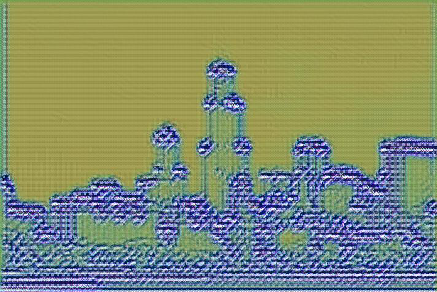
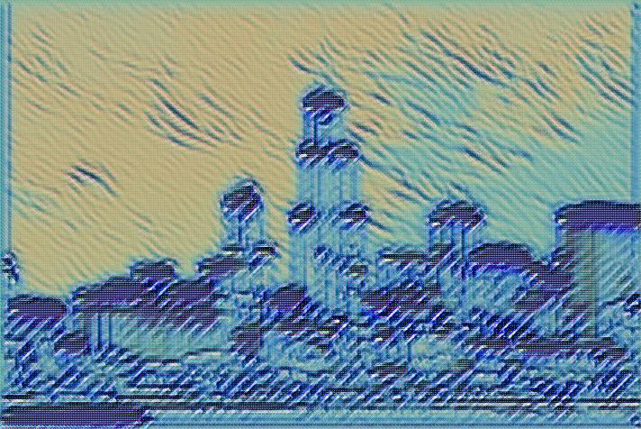
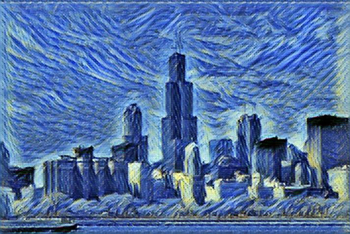

## Installation
### Python
Install python and pip: 
```
sudo apt-get install python-pip python-dev build-essential git
```
### Neural network for style transfer

Install TensorFlow:
```
pip install tensorflow-gpu
```
Download this code:
```
git clone https://github.com/lengstrom/fast-style-transfer.git
cd fast-style-transfer
mkdir bin
mkdir checkpoint
```
Download pre-trained ImageNet model:
```
mkdir data && cd data
wget http://www.vlfeat.org/matconvnet/models/beta16/imagenet-vgg-verydeep-19.mat
```
Download train dataset (about 13G):
```
wget http://msvocds.blob.core.windows.net/coco2014/train2014.zip
unzip train2014.zip
```
Download reference image to take style from and save it to current dir. You can chose any picture your like. For this example we chose Starry Night by Van Gogh.

![Starry night]
(images/git_img/starry_night.jpg?raw=true "Starry night")

Train model: 
```
python style.py --style reference.jpg  --checkpoint-dir checkpoint
```
The longer you train neural network, the better result you get.






### Web application

Download code:
```
git clone https:/github.com/boosteroid/style-transfer-app
cd style-transfer-app
```
Set path to your trained model at styling.py:
```
ABSOLUTE_PATH = ‘/home/username/fast-style-transfer’
```
Finally run your application:
```
python app.py
```
Now it's alive and available at port 8080. That’s it.

![Example]
(images/git_img/example.png?raw=true "Example")
